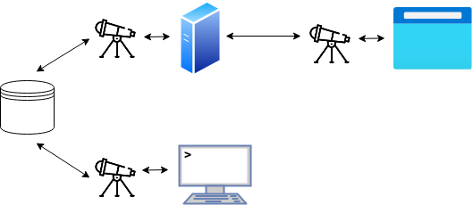

<div align="center">

# Telescope

</div>

### Table of Contents
- [Introduction](#introduction)
- [Typical Workflow](#typical-workflow)
- [Application Architecture](#application-architecture)
- [Why Create Telescope?](#why-create-telescope)
- [Under the Hood](#under-the-hood)
- [Contributing](#contributing)
- [Name](#name)

# Introduction
**In development. Not production ready.**

Telescope helps you build reactive web apps with Haskell, fast. Telescope
achieves this by abstracting away common tasks you need to undertake when
developing a web app, **allowing you to focus on your data** and **reducing the
time you need to build your app**.

<a href="https://unsplash.com/photos/_Sr03VSKIeg">
  
</a>

An application built with Telescope is..
- **reactive:** don't worry about keeping client-side and server-side data in
  sync, with Telescope your frontend can automatically react to changes in your
  database and your database can be updated seamlessly by your frontend!
- **strongly-typed:** writing Haskell across the stack prevents server/client
  protocol mismatches and other run-time errors, allowing you to move fast and
  not break things.
- **consistent:** use the same interface for database access, whether you're
  writing server-side code or client-side code!
- **minimal:** let Telescope handle the database and server for you, so you can
  focus on your business logic. Or if you prefer, integrate Telescope with your
  existing Haskell stack.

What can't Telescope do?
- Provide a full-featured database query language.
- Generate a small file to be sent to web clients.

Telescope is particularly well-suited for applications where events are pushed
by the server e.g. notifications and dashboards. Telescope also handles forms
and input-validation very well. On the flip-side, applications with heavy
client-side computation such as animations are not well-suited for Telescope.

## Typical Workflow
Building a reactive web app with Telescope looks something like this:

**1.** Declare the data types used in your application.

``` haskell
data TodoList = TodoList {
    name  :: String
  , items :: [String]
  } deriving (Generic, Show)

instance PrimaryKey TodoList where
  primaryKey = name
```

**2.** Populate your database with some dummy data so you can test your app.

``` haskell
T.set $ TodoList "pancakes" ["eggs", "milk", "flour"]
```

**3.** Start the Telescope server (or integrate it with your existing
[Servant](https://www.servant.dev/) Server).

``` haskell
Server.run port
```

**4.** Write the frontend of your reactive web app with [Reflex](https://reflex-frp.org/)!

``` haskell
-- NOTE: work in progress.
main = mainWidget $ el "div" $ do
  el "h3" $ text "View a list:"
  input   <- textInput def
  results <- T.view (constant TodoList{}) $ updated $ input ^. textInput_value
  dynText =<< (holdDyn "No results." $ (pack . show) <$> results)
```

**5.** Modify data in your database and watch your frontend react!

``` haskell
T.over $ TodoList{} "pancakes" (++ ["sugar", "lemon juice"])
```

A full tutorial and demo application are available TODO.
<!-- TODO: links to reflex-platform and other doc in demo/README.md -->

## Application Architecture
The most important component of Telescope from a developer's perspective is the
Telescope interface, a set of functions that allow you to access external data.
This interface is available both for server-side and client-side code.

The following diagram shows one possible setup of a Telescope application. In
this diagram each telescope icon represents usage of the Telescope interface.
The bottom row of the diagram represents a developer working on their machine
and interacting with a development server running on the same machine. More
specifically the developer has opened a GHCI repl and imported the Telescope
interface and is using that to interact with the database.

The top row of the diagram represents client-code running in a browser
interacting with a server via the Telescope interface. The server itself is
interacting with the database via the Telescope interface. In effect the server
is only a proxy to the database for the client, allowing both server-side and
client-side code to access the database via the same interface.

<!-- Parameterised, data source agnostic, alternate configuration. -->

<!-- Data is DRY. -->

<p align="center">
  
</p>

## Why create Telescope?
There are many different web frameworks out there, and they all have pros and
cons. They pretty much all allow you to write reuseable components. Some can
ship a small file to the client, some allow you to write your server-side and
client-side code in the same language, some can pre-render server-side for a
speedy TTI (time to interactive).

One idea that has become fairly popular in recent years is that of a reactive
frontend. Whereby the view is written as a function of the current state, and
whenever the state changes, the view "reacts" to the change and is updated.

Implementations of reactive frontends vary, one possible implementation is
"data-binding", available as one-way in React and two-way in Polymer. With this
implementation the data "flows" up/down your tree of components. With React you
still have to do some work in order to update parent nodes because the binding
is only one-way (parent to child). A solution to this problem with React is to
use the library Redux to manage state.

Polymer and Vue provide more powerful solutions for data flow that allow you to
write your frontend as a function of your application state. However, in both
cases you still have to manage communication with your server. The primary
motivation behind the Telescope framework is that a developer should be able to
write their frontend as a function of data, liberated from concerns of *where*
that data is stored or *when* that data is updated.

## Under the Hood
TODO talk about how generic programming allows handling of most data types.

## Contributing
Install the [Nix](https://nixos.org/download.html) package manager, clone this
repository (with submodules) and change in to the `telescope` directory. If
you’ve never built a project with `reflex-platform` before you'll also need to
run a configuration step. Note that initial builds will take a looong time.

``` bash
curl -L https://nixos.org/nix/install | sh
git clone --recurse-submodules https://github.com/jerbaroo/telescope
cd telescope
./reflex-platform/try-reflex # Configure reflex-platform.
```

Development commands for the Telescope framework:

``` bash
# Type-check the package passed as first argument.
./scripts/check.sh telescope
# Run tests for all Telescope packages.
./scripts/test.sh
```

Development commands for the demo application:

``` bash
# Build the demo-backend or demo-frontend packages.
./scripts/build/dev/backend.sh 
./scripts/build/dev/frontend.sh 
# Run a server for demo-backend, or demo-frontend.
./scripts/run/dev/backend.sh
./scripts/run/dev/frontend.sh
# Type-check the package passed as first argument.
./scripts/check.sh demo-backend
# Enter a REPL for interacting with demo database.
./scripts/repl.sh
```

Production commands for the demo application:

``` bash 
# Build the demo-backend server.
./scripts/build/prod/backend.sh 
# Generate demo-frontend static files.
./scripts/build/prod/frontend.sh 
# Run a server for demo-backend.
./scripts/run/prod/backend.sh
```

## Name
Before this framework was able to setup a database or a server, it really just
provided an interface to access remote data i.e. data stored in a database or
data over the network. This interface is "lens-like", the fucntions are similar
to the functions `view`, `set` etc. that you may know from the `lens` library.
So if you squint your eyes a little you could say this library provides a lens
to look at remote data... like a telescope.
